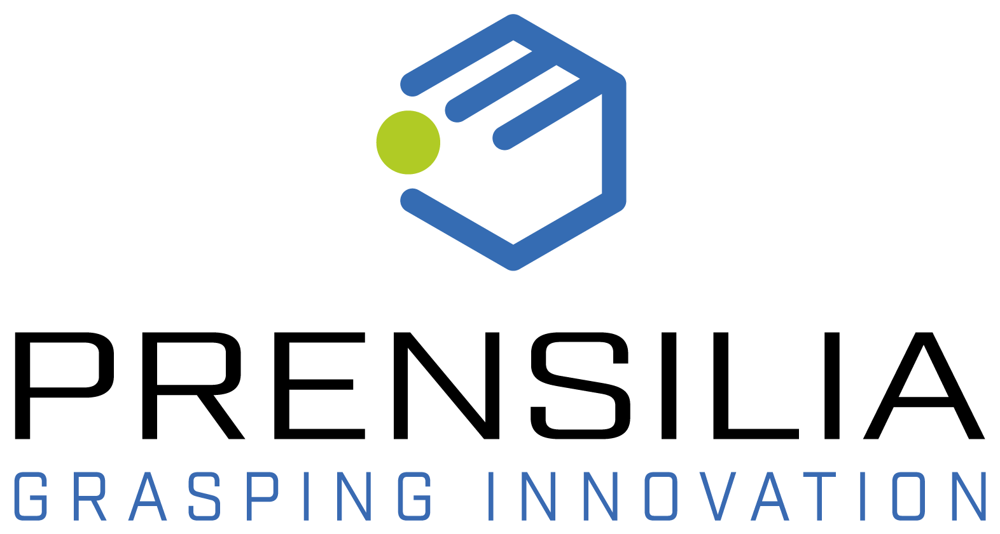

<h1 id="call for abstracts" style="text-align: center; margin-top: 50px; margin-bottom: 20px; font-size: 42px; font-weight: bold">Call for abstracts</h1>

We solicit the submission of extended abstracts up to 2 pages (excluding references and supplementary material). This workshop aims to foster interdisciplinary dialogue on how to design Human-Robot systems that balance autonomy and user control, with a particular focus on preserving and enhancing the user's sense of agency. 
We welcome contributions addressing (but not limited to) the following topics:   

<ul style="margin-top: 5px; margin-left: 20px; margin-bottom: 5px; list-style-type: disc;">
    <li>  Neuroscientific foundations of agency, embodiment, and ownership.</li>
    <li>  Frameworks of shared autonomy in Human-Robot Interaction.</li>
    <li>  Experimental studies on the impact of shared control on agency and behavior.</li>
    <li>  Sensory feedback and multimodal communication to support intuitive interaction.</li>
</ul>

This is an opportunity to share ongoing or completed research and engage in rich discussions with experts from robotics, neuroscience, psychology, and human-computer interaction.   
All accepted contributions will be presented in interactive poster sessions. Posters should clearly communicate the main ideas, methods, and findings, and will serve as a basis for interactive discussion.  

Submission Guidelines:  
<ul style="margin-top: 5px; margin-left: 20px; margin-bottom: 5px; list-style-type: disc;">
    <li> Abstracts should be max 2 page, excluding references and supplementary material.</li>
    <li> Please submit in PDF format via EasyChair (<a href="https://easychair.org/conferences/?conf=sasa2025" target="_blank">EasyChair submission link</a>).</li>
</ul>

In addition, authors of accepted abstracts will be asked to register and submit a 3-minute spotlight video. These videos will be available on the workshop website and LinkedIn page prior to the event to engage participants, and will be streamed during the coffee break sessions. These short videos are intended to spark curiosity and encourage in-depth discussions during the poster sessions.  

<h1 id="important dates" style="text-align: center; margin-top: 50px; margin-bottom: 20px; font-size: 42px; font-weight: bold">Important dates</h1>

Abstract submission deadline:  September 23rd, 2025  October 7th, 2025, 23:59 CEST  
Notification of acceptance:  September 30th, 2025  October 10th, 2025  
Videos submission deadline:  October 6th, 2025  October 16th, 2025, 23:59 CEST 

<h1 id="poster award" style="text-align: center; margin-top: 50px; margin-bottom: 20px; font-size: 42px; font-weight: bold">Poster award</h1>

To recognize outstanding contributions and encourage high-quality presentations, the workshop will include a Best Poster Award. All accepted posters will be evaluated based on the following criteria: 
<ul style="margin-top: 5px; margin-left: 20px; margin-bottom: 5px; list-style-type: disc;">
    <li> Methods.</li>
    <li> Results.</li>
    <li> Clarity.</li>
    <li> Relevance with the workshop.  </li>
</ul>

The winners will be announced at the end of the workshop and highlighted on the workshop website and communication channels.  
The poster award includes <strong>cash prizes</strong>, <strong>reimbursements</strong> and an exclusive <strong>50% discount</strong> on a motion capture system from the <strong>Perception Neuron</strong> product line. 
The poster award is generously sponsored by:
<ul style="margin-top: 5px; margin-left: 20px; margin-bottom: 5px; list-style-type: disc;">
    <li>The IEEE-RAS Technical Committee on BioRobotics.</li>
    <li>Prensilia SRL.</li>
    <li>Perception Neuron (registered trademark of Noitom Ltd).</li>
</ul>

    
    
    

<h1 id="accepted abstracts" style="text-align: center; margin-top: 50px; margin-bottom: 20px; font-size: 42px; font-weight: bold">Accepted abstracts</h1>

The following abstracts have been accepted for our workshop:
<ul style="margin-top: 5px; margin-left: 20px; margin-bottom: 5px; list-style-type: disc;">
    <li><i>"Upper-Limb Rehabilitation with a Dual-Mode Individualized Exoskeleton Robot: A Generative-Model-Based Solution"</i>; Yu Chen, Shu Miao, Jing Ye, Gong Chen, Jianghua Cheng, Ketao Du, and Xiang Li.</li>
    <li><i>"A Probabilistic Shared Control Framework for Navigation"</i>; Pinhao Song, Yurui Du, Ophelie Saussus, Sofie De Schrijver, Irene Caprara, Peter Janssen, Renaud Detry.</li>
    <li><i>"HannesImitation: Grasping with the Hannes Prosthetic Hand via Imitation Learning"</i>; Carlo Alessi, Federico Vasile, Federico Ceola, Giulia Pasquale, Nicolò Boccardo, and Lorenzo Natale.</li>
    <li><i>"Assist-as-Attended: Gaze-Based Cognitive Human–Robot Collaboration in Robot-Assisted Pedicle Screw Placement"</i>; Chen Chen, Qikai Zou, Yuhang Song, Mingrui Yu, Senqiang Zhu, Shiji Song, and Xiang Li.</li>
    <li><i>"Preserving Sense of Agency: User Preferences for Robot Autonomy and User Control across Household Tasks"</i>; Claire Yang, Heer Patel, Max Kleiman-Weiner, Maya Cakmak.</li>
    <li><i>"Cognitive and Trust-Aware Shared Autonomy: Modulating Robot Assistance from Multimodal User State View in HRI"</i>; Juan José García Cárdenas and Adriana Tapus.</li>

</ul>

