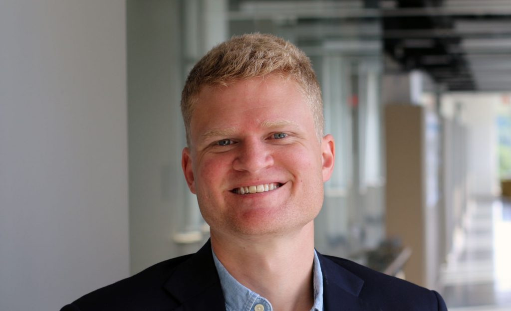
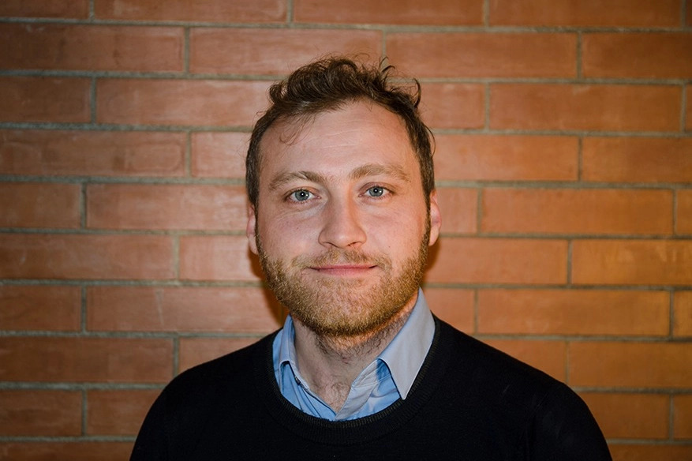
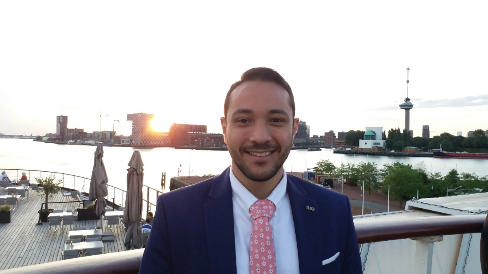

    <a href="#abstract" style="margin: 0 10px; text-decoration: none;">Abstract</a> |
    <a href="#organizers" style="margin: 0 10px; text-decoration: none;">Organizers</a> |
    <a href="#schedule" style="margin: 0 10px; text-decoration: none;">Schedule</a>

    
    

        Your Text Here
    

# Abstract
Add your abstract text here. This section describes the main points and purpose of the workshop.

# Organizers 

    

        
        
Dylan Losey

    

    

        
        
Marco Controzzi

    

    

        
        
Ahmed Shehata

    

# Schedule

| Time          | Topic                    | Speaker        |
|---------------|--------------------------|----------------|
| 9:00 - 9:30   | Opening Remarks          | Dylan Losey    |
| 9:30 - 10:30  | Morning Session          | Marco Controzzi |
| 10:30 - 10:45 | Coffee Break             | -              |
| 10:45 - 12:00 | Technical Presentation   | Ahmed Shehata  |