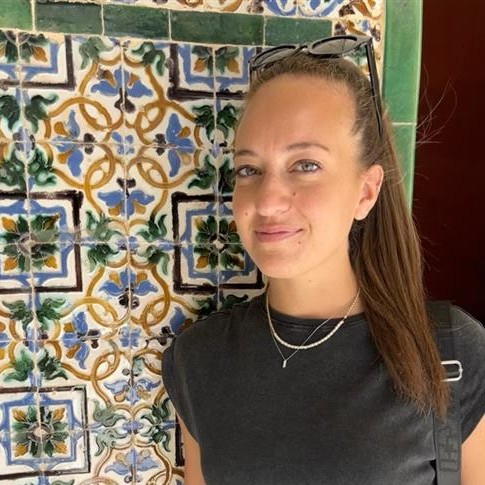

    <a href="#abstract" style="margin: 0 10px; text-decoration: none;">Abstract</a> |
    <a href="#Organizers" style="margin: 0 10px; text-decoration: none;">Organizers</a> |
    <a href="#Speakers" style="margin: 0 10px; text-decoration: none;">Speakers</a> |
    <a href="#Schedule" style="margin: 0 10px; text-decoration: none;">Schedule</a>

    
    

        2024 IROS Half-day Workshop 
    

    

        Shared Autonomy and the Sense of Agency: Balancing Control, Effort, and Experience in Human-Robot Interaction 
    

<h1 id="abstract" style="text-align: center; margin-top: 30px;">Abstract</h1>

Shared autonomy is revolutionizing Human-Robot interaction by seamlessly blending human intent with robot abilities. 
This paradigm holds the potential to enhance user performance and experience across various applications, from remote manipulation to assistive technologies, like prostheses.
However, a critical challenge remains: how can we modulate robot autonomy to reduce user effort while preserving the user's sense of agency? This workshop seeks to address this question by providing an overview about the link between shared autonomy and the sense of agency, starting from neuroscientific foundations and covering various application fields that share the common aspect of controlling external elements (prosthetics, teleoperation, etc.). 

To address this, the workshop aims to explore three main questions.  
<ul style="margin-top: 5px; margin-left: 20px; margin-bottom: 5px; list-style-type: disc;">
    <li>Which are the neuroscientific bases underlying the concepts of embodiment, ownership and sense of agency?</li>
    <li>How can we determine the appropriate levels of autonomy for different tasks and users?</li>
    <li>How can communication channels be effectively leveraged to enhance situational awareness, reduce cognitive load, and create a more natural control experience?</li>
</ul>

Designing safe, efficient, and user-friendly human-machine control systems requires a deep understanding of how individuals experience agency and how it impacts their behavior. During the past years, various workshops at the main conferences in robotics have addressed topics such as sensory feedback and shared autonomy in Human-Robot interaction. This workshop brings a novel perspective by exploring these aspects from the viewpoint of the sense of agency. We invite researchers to engage in discussions on these topics, fostering a collaborative environment to advance the state of shared autonomy. 

<h1 id="Organizers" style="text-align: center; margin-top: 30px;">Organizers</h1> 

    

        
        
Marco Controzzi

        
Associate Professor

        
Sant'Anna School of Advanced Studies

    

    
    

        
        
Dylan Losey

        
Assistant Professor

        
Virginia Tech

    

    

        
        
Ahmed Shehata

        
Adjunct Professor

        
University of Alberta

    

    
    

        
       
Manuela Uliano

        
PhD Student

        
Sant'Anna School of Advanced Studies

    

    

    

        
        
Silvia Fattorini

        
PhD Student

        
Sant'Anna School of Advanced Studies

    

<h1 id="Speakers" style="text-align: center; margin-top: 30px;">Speakers</h1> 

    

        
        
Wen Wen

        
Associate Professor

        
University of Rikkyo

    

    
    

        
       
Freek Stulp

        
Head of Department of Cognitive Robotics

        
German Aerospace Center (DLR)

    

    

<h1 id="Schedule" style="text-align: center; margin-top: 30px;">Schedule</h1> 

<table style="border-collapse: collapse; width: 100%;">
  <thead>
    <tr>
      <th style="border: 1px solid #ddd; padding: 8px; text-align: left;">Time</th>
      <th style="border: 1px solid #ddd; padding: 8px; text-align: left;">Topic</th>
      <th style="border: 1px solid #ddd; padding: 8px; text-align: left;">Speaker</th>
    </tr>
  </thead>
  <tbody>
    <tr>
      <td style="border: 1px solid #ddd; padding: 8px;">8:30 - 8:45</td>
      <td style="border: 1px solid #ddd; padding: 8px;">Welcoming remarks</td>
      <td style="border: 1px solid #ddd; padding: 8px;"></td>
    </tr>
    <tr>
      <td style="border: 1px solid #ddd; padding: 8px;">8:45 - 9:10</td>
      <td style="border: 1px solid #ddd; padding: 8px;">First talk + Q&A</td>
      <td style="border: 1px solid #ddd; padding: 8px;">Wen Wen</td>
    </tr>
    <tr>
      <td style="border: 1px solid #ddd; padding: 8px;">9:10 - 9:35</td>
      <td style="border: 1px solid #ddd; padding: 8px;">Second talk + Q&A</td>
      <td style="border: 1px solid #ddd; padding: 8px;">?</td>
    </tr>
    <tr>
      <td style="border: 1px solid #ddd; padding: 8px;">9:35 - 10:00</td>
      <td style="border: 1px solid #ddd; padding: 8px;">Third talk + Q&A</td>
      <td style="border: 1px solid #ddd; padding: 8px;">?</td>
    </tr>
    <tr>
      <td style="border: 1px solid #ddd; padding: 8px;">10:00 - 10:30</td>
      <td style="border: 1px solid #ddd; padding: 8px;">Coffee break and Poster session</td>
      <td style="border: 1px solid #ddd; padding: 8px;"></td>
    </tr>
    <tr>
      <td style="border: 1px solid #ddd; padding: 8px;">10:30 - 10:55</td>
      <td style="border: 1px solid #ddd; padding: 8px;">Fourth talk + Q&A</td>
      <td style="border: 1px solid #ddd; padding: 8px;">Freek Stulp</td>
    </tr>
    <tr>
      <td style="border: 1px solid #ddd; padding: 8px;">10:55 - 11:20</td>
      <td style="border: 1px solid #ddd; padding: 8px;">Fifth talk + Q&A</td>
      <td style="border: 1px solid #ddd; padding: 8px;">?</td>
    </tr>
    <tr>
      <td style="border: 1px solid #ddd; padding: 8px;">11:20 - 12:00</td>
      <td style="border: 1px solid #ddd; padding: 8px;">Panel session</td>
      <td style="border: 1px solid #ddd; padding: 8px;"></td>
    </tr>
    <tr>
      <td style="border: 1px solid #ddd; padding: 8px;">12:00 - 12:30</td>
      <td style="border: 1px solid #ddd; padding: 8px;">Poster session</td>
      <td style="border: 1px solid #ddd; padding: 8px;"></td>
    </tr>
    <tr>
      <td style="border: 1px solid #ddd; padding: 8px;">12:30 - 12:45</td>
      <td style="border: 1px solid #ddd; padding: 8px;">Closing remarks and Poster awards</td>
      <td style="border: 1px solid #ddd; padding: 8px;"></td>
    </tr>
  </tbody>
</table>

